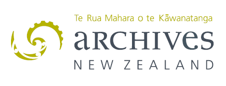



#ASA Parallel Lines Workshop Preview
*Date: 2016-09-28, 1400-1700 hours*

##Processing born-digital collections and what to do when digital objects prove to be problematic? 
Institutions are beginning to develop different goals to measure the success of a digital transfer. For some institutions dealing with continuous streams of data into their repository, the bottleneck of identification and validation is too great – content needs to be triaged quickly but should later be re-visited. For institutions with smaller born-digital collections, there is an opportunity to be more flexible with core digital preservation practices such as identification. Given the opportunity to work with smaller collections, decision making can often be idealistic, but sometimes it does require a more pragmatic approach – transfer may be complete – but the collection still requires work to improve its overall fidelity. This workshop focuses on the steps that we need to take pre- or post- ingest once identification of validation of content has failed. The workshop will look at the concept of a Rogues Gallery for isolation and analysis of content pre-ingest; the use of issues logs (a register of technical practice) for maintaining the consciousness of work that needs to be completed over the entire course of a transfer, pre- during-, post-, and provide examples of tools and processes that we have at our disposal to improve the transfer, and preservation of born-digital material over time, for your organisation and the community.

####Key Words: 

*#RoguesGallery*, *#RegisterOfTechnicalPractice*, *#Triage*, *#ArtOfTheArchivist*, *#DigitalPreservation*, *#Tools*, *#Community*

##Today's Schedule

*1400-1405: Workshop Introduction*

*1405-1415: Progress report (Talei Masters)*
* Building the capability to accept born-digital transfers

*1415-1420: ASA Survey Results*
* What are *they* expecting from this?

*1420-1455: Introduction (Jan Hutař)*
* What, What, Why... and a little bit of how?

*1455-1510: Tea and Coffee Break*

*1510-1555: Rsync YouSync We All Sync (Andrea K. Byrne)*
* Core tools in our developing workflows...

*1555-1600: Rest Break*

*1600-1640: Preservation Capability Miscellany (Ross Spencer)*
* Building capability step-by-step, problem-by-problem... 

*1640-1700: What comes next? + Discussion*
* Open discussion, additional questions, and an opportunity to connect with others

*1700: Outro and Thank you*
